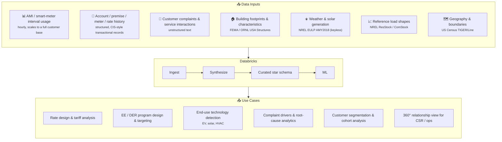

# Customer 360 for Utilities

[](https://databricks.com)
[](https://docs.databricks.com/en/data-governance/unity-catalog/index.html)
[](https://docs.databricks.com/en/compute/serverless.html)

Utilities accumulate an enormous amount of customer data — smart-meter intervals,
account and rate history, building characteristics, weather, and the unstructured
record of every complaint and service call — but it's usually scattered across a
dozen systems, each refreshed at a different time, and impossible to query
together. **Customer 360 for Utilities** brings all of it into one governed,
curated data model: **fresh** rather than a quarterly extract, **scalable** to
what AMI data actually produces (hourly interval reads across a full customer
base, not a thin sample), and spanning both **structured** signal (usage, rates,
transactions) and **unstructured** signal (complaint text, service interactions)
side by side. On top of that model sit a **Genie space** for natural-language
ad hoc analysis and an **interactive app** — an exploration map, relationship
history, complaint drivers, and ML predictions — built directly on the curated
tables.

That foundation is what unlocks the use cases utilities actually pay for: rate
design grounded in real interval data, EE/DER program targeting based on who can
actually benefit, end-use technology detection (EV, solar, HVAC) without a truck
roll, complaint root-cause analytics that closes the loop between what customers
say and what their meter shows, and cohort/segmentation views an analyst or CSR
can use instead of stitching together five screens. All of it in service of the
metric utilities are ultimately measured on: **customer satisfaction**.



Every use case above feeds a single outcome utilities care about most: **CSAT
improvement** — fewer surprised customers, faster complaint resolution, and
programs targeted at the households and businesses that actually need them.

## Intent: what this repo is (and isn't)

This is a **demo and accelerator repo**, not a production data platform. Two
things are worth understanding before you dig into the pipeline:

- **The ETL deliberately balances grounded and synthetic data.** Buildings,
  their locations, and county boundaries are real (FEMA/ORNL footprints, Census
  TIGER geography) — but no utility will hand over real customer usage data for
  a public demo, so hourly consumption, complaints, and account history are
  synthetically generated to be *statistically realistic* against those real
  buildings (e.g., load shapes conditioned on real building characteristics and
  weather). Getting that balance right — real enough to be credible, synthetic
  enough to be shareable — is most of what the pipeline in `src/` actually does.
- **The real value is the accelerator, not the demo data.** The data model, the
  visuals, the ML models, and the app behavior are all meant to be replaced or
  extended by the utility that adopts this: swap in a real AMI feed, add real
  rate structures, retrain the ML on real meters, reskin the app. See
  [Make it yours](#make-it-yours) below for the concrete steps to do exactly
  that. This repo is a vetted starting point, not a finished product —
  it will keep evolving; see
  [Status / known follow-ups](#status--known-follow-ups).

## Quickstart

```bash
# 1. Point at your environment. The catalog must already exist; the schema is
#    created for you. These two vars are the only things you must set.
databricks bundle deploy \
  --var catalog=my_catalog \
  --var schema=customer_360 \
  --var warehouse_id=<sql_warehouse_id>

# 2. Run the end-to-end data + ML pipeline (one Job orchestrates everything).
databricks bundle run customer_360_job

# 3. (Apps) build the app, deploy, create its focus-set table, grant the SP,
#    then start it.
(cd app && npm install && npm run build)
databricks bundle deploy --var catalog=my_catalog --var schema=customer_360
databricks bundle run app_focus_set_setup
bash app/scripts/grant-permissions.sh          # CATALOG=.. SCHEMA=.. WAREHOUSE_ID=..
databricks bundle run customer_360              # start the app
```

## Architecture (at a glance)

The diagram above shows the *what* (inputs → Databricks → use cases). A few things
are worth calling out about *how* it's built:

- **A single orchestration job.** One Job (`customer_360_job`) runs the
  entire DAG end to end — ingest, synthesize, curate, and train/score ML — so the
  whole solution stands up (or refreshes) from a single command.
- **A curated star schema at the center.** The heart of the solution is a
  well-modeled star schema (`dim_*` / `fact_*` / `bridge_*`, with `metric_*`
  views on top) that everything else — the app, the Genie space, the ML models —
  reads from. It's a shared, governed source of truth, not a pile of ad hoc
  tables.
- **UC-managed Delta tables with real metadata.** Every table is a Unity
  Catalog–managed Delta table, so you get solid query performance out of the box
  plus genuine metadata — foreign-key constraints, column comments, and lineage —
  that makes the model self-describing to analysts, to Genie, and to the app's
  ERD alike.
- **Modular by design.** Each tier (ingest / synthesize / curate / ML features)
  is an independent module publishing to the one schema, so a real utility can
  swap any piece — a data source, the schema shape, a model — without unpicking
  the rest.
- **MLflow-managed models.** The ML models (EV / PV detection, complaint
  prediction) are trained, tracked, and versioned with MLflow against the Unity
  Catalog model registry, so runs, metrics, and the registered models that back
  the app's predictions are all reproducible and governed.
- **An AppKit app on top.** The app reads the curated tables directly; catalog +
  schema are injected at runtime, so the same build deploys to any environment.

See [`ARCHITECTURE.md`](./ARCHITECTURE.md) for the full design (and the planned
boundary-spine follow-up).

## Make it yours

This repo is designed to be taken apart and rebuilt around a real utility's data,
not run as-is. That's a real path with a real order of operations — here's what
it actually looks like:

1. **Bring your own data.** Replace the synthetic `raw_*` sources — AMI interval
   reads, account/premise/meter/rate history, complaints, building
   characteristics — with real feeds of the same shape. Each curated source is
   reached through a `*_schema` config key rather than a hardcoded table
   reference (see `ARCHITECTURE.md` §6), so this is a swap, not a rewrite: point
   the key at your table and drop the generator that used to fake that source.
   You likely won't have every source the demo has (ResStock/ComStock load
   shapes are already optional here) — that's fine, the demo is built to run
   with fewer inputs than it ships with.
2. **Refine the curated layer.** This is where the real modeling work happens.
   The demo's star schema (`dim_*` / `fact_*` / `bridge_*`) is a reasonable
   starting shape, but your rate structures, service classes, account
   hierarchies, and history semantics won't match it exactly — expect to add,
   split, or reshape tables here. This is also where you'll infer anything your
   raw data doesn't hand you directly (derived segments, imputed attributes,
   reconciled identities across source systems) — push that logic into the
   curated transformations rather than the app.
3. **Update the app to the new model.** The app's queries
   (`app/config/queries/*.sql`) and map layer are written against the demo's
   curated schema, not a generic interface — once step 2 changes that schema's
   shape, these need to change with it. Budget real time here; this isn't a
   config toggle.
4. **Apply your brand.** `app/client/src/config.ts` is the single source for
   the customer-facing utility name, and the theme lives in CSS custom
   properties in `app/client/src/App.css` (`--accent` and friends) —
   deliberately brand-neutral in the demo so they're a straight swap for your
   logo and color scheme.
5. **Build ML models for your actual priorities.** `40_ml/ev_detector/` (EV
   detection from AMI patterns) is a reference pattern to copy, not the model
   every utility needs — see `ARCHITECTURE.md` §8 for the four-file structure
   and drop in a `40_ml/<model>/` for whatever you're actually trying to solve
   (churn, DER siting, outage risk, load forecasting, ...).
6. **Tune scale and geography** as you go — `customer_sample_size`,
   `states_filter` / `state_fips` / `target_geoids` / `target_state` —
   these are the cheap knobs, not the hard work.

## Data sources & attributions

- **FEMA / ORNL USA Structures** — building footprints (CC BY 4.0).
- **NREL End-Use Load Profiles (EULP), AMY2018 weather** — hourly temperature +
  solar irradiance, per county (OEDI public S3, keyless).
- **NREL ResStock / ComStock** — building load profiles + PV generation shape (OEDI public S3; optional).
- **US Census TIGER/Line** — county boundaries (public domain).

## Status / known follow-ups

- **Before a true public release:** confirm `@databricks/appkit` is installable
  from the public npm registry and regenerate `app/package-lock.json` against it
  (the internal `.npmrc` + lockfile are gitignored); the boundary-spine redesign
  (ARCHITECTURE.md §10 Roadmap) is planned.
